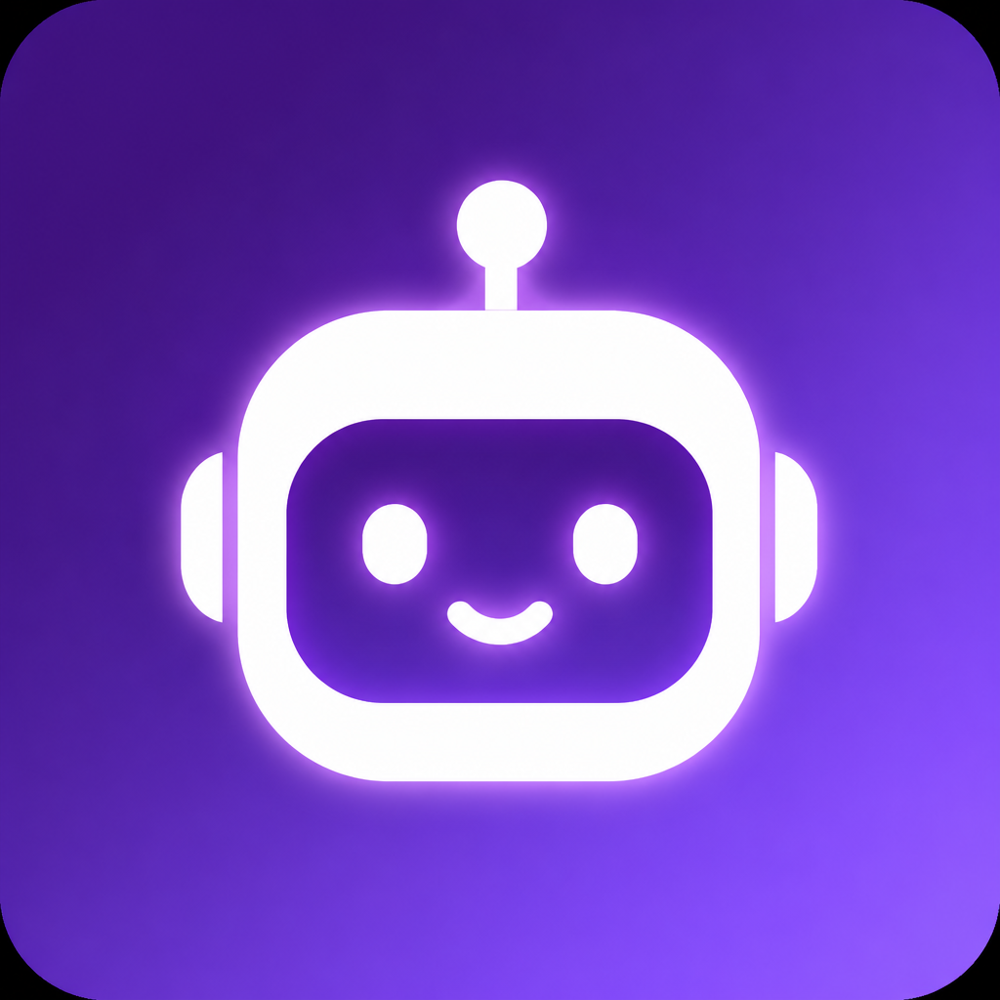
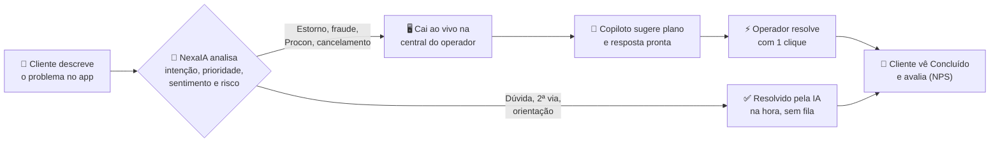
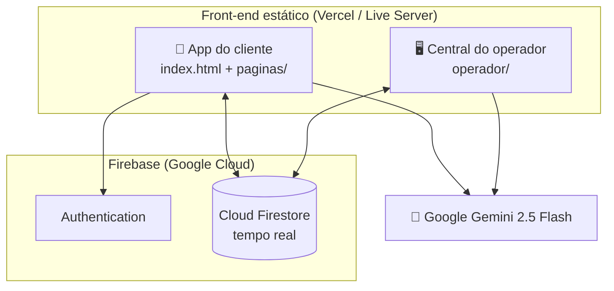

<div align="center">



# NexaTalk AI

### Atendimento corporativo (ITSM B2B) em que a IA resolve primeiro e o humano entra só quando precisa

O cliente abre o chamado no celular, a **NexaIA** (Google Gemini) faz a triagem em segundos, resolve sozinha o que dá e manda o resto, já analisado, para uma central de operadores com copiloto. Tudo sincronizado em tempo real no Firebase.

<br>

[](https://nexa-talk-ai.vercel.app)
[](https://github.com/eucesar/NexaTalk_AI)


<sub>Projeto do <b>Challenge FIAP × Claro</b> · desenvolvido por <a href="https://github.com/eucesar">Cesar Iglesias</a></sub>

</div>

---

## Teste em 30 segundos

Abra **[nexa-talk-ai.vercel.app](https://nexa-talk-ai.vercel.app)** e entre com as contas de demonstração. Os campos do cliente já vêm preenchidos.

| Experiência | Onde entrar | E-mail | Senha |
|---|---|---|---|
| 📱 **App do cliente** (mobile) | Tela inicial | `cliente@nexatalk.com` | `nexa123` |
| 🖥️ **Central do operador** (desktop) | Botão **Acessar Central do Operador** | `operador@nexatalk.com` | `nexa123` |
| 👔 Supervisor (opcional) | Mesma central | `supervisor@nexatalk.com` | `nexa123` |

> **O que funciona na demo online:** login, banco de dados em tempo real, os chamados da conta demo, a fila do operador, o Centro de Comando, a Arena e a gamificação.
> **Os recursos de IA generativa** (triagem, copiloto, chat, voz) usam uma chave da Gemini que fica só na máquina local e não é publicada. Para ver a IA ao vivo, rode o projeto localmente — leva 2 minutos ([veja como](#rodar-localmente)).

---

## O problema

Empresas B2B recebem dezenas de chamados por dia: cobrança, logística, suporte, cadastro. Um ITSM clássico joga tudo numa fila humana — inclusive a pergunta "como tiro a 2ª via do boleto?". O time gasta horas com o que poderia ser automático e os casos críticos (fraude, Procon, cancelamento) esperam junto com o resto.

## A solução

O NexaTalk AI inverte a lógica: **a IA atende primeiro e o humano vira exceção.**



1. O **cliente** descreve o problema no app — digitando ou falando.
2. A **NexaIA** classifica intenção, prioridade, sentimento e risco.
3. Se der para resolver na hora, a IA **fecha o chamado sozinha**.
4. Se exigir ação humana, o chamado aparece **em tempo real** na central do operador, já analisado.
5. O operador quase não digita: plano de ação, resposta pronta e **"Resolver com IA em 1 clique"**, com a qualidade auditada pela própria IA.
6. O cliente vê a resposta e o status **Concluído** no app.

---

## Destaques

- 🤖 **Triagem com auto-resolução** — a IA decide sozinha o que resolve e o que escala, seguindo uma política clara de risco.
- 🎙️ **Abrir chamado por voz** — o cliente fala, a Gemini transcreve e preenche o texto.
- 🧠 **Copiloto do operador** — radar de riscos, plano de ação, resposta pronta, playbook de churn e fraude.
- ⚡ **Resolver com 1 clique** — a IA escreve a resposta final e a auditoria de qualidade dá nota de empatia, clareza e detalhe.
- 📊 **Centro de Comando** — KPIs ao vivo (SLA, NPS, volume, humor da fila) e relatório executivo escrito pela IA.
- 🎮 **Modo Jogo** — XP, níveis, conquistas, ranking ao vivo e um Dojo em que a IA simula clientes difíceis para treinar o time.
- 📚 **Base de Conhecimento Viva** — a IA minera a fila e escreve artigos; o operador aprova.
- 📲 **PWA** — instala na tela inicial do celular.

---

## Duas experiências

### 📱 App do cliente (mobile web)

Moldura de celular, tema dark animado, login com Firebase Auth.

- Abrir chamado com **"melhorar descrição com IA"**, **voz** e opção de simplificar ou traduzir o texto
- Triagem que resolve na hora **ou** encaminha com protocolo
- Meus atendimentos, detalhes e a mensagem que a operação enviou
- **Falar com a NexaIA** — chat que conhece os chamados e o perfil do cliente
- Consulta **sem login** por protocolo ou e-mail
- **NPS** depois da conclusão (estrelas + "a IA resolveu?")
- **Perfil Nexa** com XP, níveis e conquistas

A conta `cliente@nexatalk.com` já vem com uma jornada completa para explorar:

| Chamado | Situação |
|---|---|
| Cobrança duplicada | Aberto na fila, aguardando operador |
| App fechando no Android | Em tratamento pela **Ana Operadora**, com mensagem ao cliente |
| Pedido #77412 atrasado | Em tratamento pela **Marina Duarte**, com mensagem ao cliente |
| 2ª via de boleto · dúvida de planos · cadastro | **Resolvidos pela IA** |
| Cancelamento do plano Premium | **Concluído** pelo **Carlos Supervisor** |

No **Perfil Nexa**: 360 XP, nível *Cliente Estrela* e as 4 conquistas desbloqueadas.

### 🖥️ Central do operador (desktop)

Layout de sistema corporativo com barra lateral.

| Módulo | O que faz |
|---|---|
| **Fila de Atendimentos** | Tempo real, filtros, busca, "Priorizar com IA", pulso emocional da fila, próximo melhor chamado e **SLA** (ok / alerta / estourado) |
| **Detalhe do chamado** | Caso completo, atribuir a mim, validar a área sugerida pela IA, copiloto, playbook de churn e fraude, **Resolver com IA em 1 clique** |
| **Histórico** | Linha do tempo do caso (cliente · IA · equipe) com resumo da NexaIA |
| **Centro de Comando** | KPIs ao vivo (SLA, NPS), gráficos, filtros e relatório executivo da IA |
| **Arena ao Vivo** | Ranking do time, pódio e feed de XP em tempo real |
| **Meu Desempenho** | Nível, notas de empatia/clareza/detalhe, conquistas e Coach IA |
| **Dojo de Treinamento** | A IA simula um cliente difícil; o operador responde e recebe nota e XP |
| **Base de Conhecimento Viva** | A IA escreve artigos a partir da fila; o operador aprova |
| **Ingestão de Dados** | Recria o cenário de demonstração completo com um clique |

---

## Onde a IA entra

Toda a inteligência usa o **Google Gemini 2.5 Flash**, com o modo de raciocínio estendido desligado para responder em poucos segundos.

| No app do cliente | Na central do operador |
|---|---|
| Triagem e auto-resolução | Insights e priorização da fila |
| Melhorar, simplificar e traduzir a descrição | Plano de ação e resposta pronta |
| Transcrição de voz | Resolver com 1 clique |
| Chat com contexto dos chamados | Auditoria de qualidade da resposta |
| Assistente em todas as telas | Resumo do histórico do caso |
| | Cliente simulado no Dojo e artigos da Base Viva |
| | Relatório executivo do Centro de Comando |

Se a cota da Gemini acabar, **o app não quebra**: fila, banco de dados e gamificação continuam, e várias telas têm um plano B local.

---

## Modo Jogo

Cliente e operador sobem de nível com XP salvo no Firestore.

| Ação | XP |
|---|---|
| Cliente abre um chamado | +20 |
| Cliente resolve com a IA na hora | +30 |
| Operador assume o caso | +10 |
| Validar ou redirecionar a área | +10 |
| Enviar resposta ao cliente | +15 |
| Concluir chamado | +50 (+ bônus de qualidade) |
| Resolver com 1 clique | +35 (+ bônus) |
| Treino no Dojo | +15 / +20 / +30 (+10 se nota ≥ 80) |
| Publicar artigo na Base Viva | +15 |
| Resumir histórico com IA | +5 |

Níveis: 0 → 100 → 300 → 700 → 1200 → 2000 XP.

---

## Arquitetura

Sem backend próprio e sem build: o front-end fala direto com o Firebase e com a API da Gemini.



| Coleção no Firestore | Conteúdo |
|---|---|
| `usuarios` | Cadastro do cliente |
| `atendimentos` | Chamados, compartilhados entre cliente e operador |
| `perfis_jogo` | XP e notas de qualidade |
| `eventos_jogo` | Feed da Arena |
| `base_conhecimento` | Artigos da Base Viva |
| `chats_nexaia` | Conversa do cliente com a NexaIA |

---

## Rodar localmente

Não precisa de Node, npm nem banco local. O Firebase já está configurado; só a IA precisa de uma chave.

**1. Clone o repositório**

```bash
git clone https://github.com/eucesar/NexaTalk_AI.git
```

**2. Configure a chave da Gemini**

Copie `js/config.example.js` para `js/config.js` e troque o valor de `apiKey`:

```javascript
apiKey: "SUA_CHAVE_GEMINI_AQUI",
```

A chave é gratuita no [Google AI Studio](https://aistudio.google.com/apikey). O `js/config.js` está no `.gitignore` e nunca sobe para o GitHub.

> Sem o `config.js`, o app usa o `config.example.js`: login e banco funcionam, só a IA fica desligada.

**3. Suba o site**

Abra a pasta no VS Code ou Cursor, instale a extensão **Live Server** e clique com o botão direito em `index.html` → **Open with Live Server** (porta 5500).

---

## Roteiro de demonstração (5 minutos)

**Cliente**

1. Entre com `cliente@nexatalk.com` / `nexa123`.
2. Veja **Meus Atendimentos** (abertos, em tratamento e resolvidos) e o **Perfil Nexa**.
3. Com a IA ligada, abra um chamado novo e compare os dois caminhos:

Este a IA resolve sozinha, sem ir para a fila:

```text
Como faço para emitir a segunda via do meu boleto? E qual o horário de atendimento de vocês?
```

Este vai para o operador com prioridade alta:

```text
Fui cobrado duas vezes na fatura deste mês e quero o estorno do valor duplicado. Se não resolverem, vou abrir reclamação no Procon.
```

**Operador**

1. Na tela inicial, clique em **Acessar Central do Operador** e entre com `operador@nexatalk.com` / `nexa123`.
2. Na **Fila**, abra um caso → **Atribuir a mim** → **Resolver com IA em 1 clique** (ou **Ver Histórico** para a linha do tempo).
3. No **Centro de Comando**, filtre 7 dias / Financeiro / Alta e gere o relatório executivo.
4. Volte ao app do cliente: o chamado aparece **Concluído** e o cliente pode dar a nota (NPS).

Se a base estiver vazia, use **Ingestão de Dados** para recriar o cenário completo.

---

## Stack

| Camada | Tecnologia |
|---|---|
| Interface | HTML5, CSS3, JavaScript puro (sem build), Bootstrap 5.3, Bootstrap Icons |
| Gráficos | Chart.js |
| Autenticação e dados | Firebase Authentication + Cloud Firestore |
| Inteligência artificial | Google Gemini API (`gemini-2.5-flash`) |
| Mobile | PWA (`manifest.json` + `sw.js`) |
| Deploy | Vercel |

```text
index.html            App do cliente (entrada)
paginas/              Telas do cliente (triagem, chat, detalhes, perfil…)
operador/             Central do operador (fila, detalhe, histórico, comando, arena…)
js/                   firebase · gemini · nexaia · operador · jogo · config
css/                  estilo.css (mobile) · operador.css (desktop)
img/                  Ícone do PWA
manifest.json, sw.js  Progressive Web App
firestore.rules       Regras do Firestore
```

---

## Próximos passos

Este é um protótipo acadêmico funcional. Para produção, os próximos passos seriam:

- Login do operador com Firebase Auth e papéis (hoje é um acesso de demonstração).
- Regras do Firestore restritas por usuário e papel (hoje estão abertas para o protótipo).
- Chamadas à Gemini por um backend ou Cloud Function, para a chave nunca ficar no navegador.

---

<div align="center">

Desenvolvido por **[Cesar Iglesias](https://github.com/eucesar)** · RM 98007 · Challenge FIAP × Claro

Se o projeto chamou sua atenção, deixe uma ⭐ no repositório.

</div>
